---
output:
  html_document:
    theme: "flatly"
    toc: true
    toc_depth: 3
    toc_float: true
    keep_md: true
  pdf_document: default
---
Wine Data Exploration by Terry Verner
========================================================


The dataset contains nearly 5000 records of white wine flavor profiles and
quality ratings.

# Univariate Plots Section


```
## [1] 4898   12
```

The dataset includes 4898 observations of 12 features.


```
## Classes 'tbl_df', 'tbl' and 'data.frame':	4898 obs. of  12 variables:
##  $ fixed.acidity       : num  7 6.3 8.1 7.2 7.2 8.1 6.2 7 6.3 8.1 ...
##  $ volatile.acidity    : num  0.27 0.3 0.28 0.23 0.23 0.28 0.32 0.27 0.3 0.22 ...
##  $ citric.acid         : num  0.36 0.34 0.4 0.32 0.32 0.4 0.16 0.36 0.34 0.43 ...
##  $ residual.sugar      : num  20.7 1.6 6.9 8.5 8.5 6.9 7 20.7 1.6 1.5 ...
##  $ chlorides           : num  0.045 0.049 0.05 0.058 0.058 0.05 0.045 0.045 0.049 0.044 ...
##  $ free.sulfur.dioxide : num  45 14 30 47 47 30 30 45 14 28 ...
##  $ total.sulfur.dioxide: num  170 132 97 186 186 97 136 170 132 129 ...
##  $ density             : num  1.001 0.994 0.995 0.996 0.996 ...
##  $ pH                  : num  3 3.3 3.26 3.19 3.19 3.26 3.18 3 3.3 3.22 ...
##  $ sulphates           : num  0.45 0.49 0.44 0.4 0.4 0.44 0.47 0.45 0.49 0.45 ...
##  $ alcohol             : num  8.8 9.5 10.1 9.9 9.9 10.1 9.6 8.8 9.5 11 ...
##  $ quality             : int  6 6 6 6 6 6 6 6 6 6 ...
```

The data types for the features are 11 numeric (float) and 1 integer.


```
##  fixed.acidity    volatile.acidity  citric.acid     residual.sugar  
##  Min.   : 3.800   Min.   :0.0800   Min.   :0.0000   Min.   : 0.600  
##  1st Qu.: 6.300   1st Qu.:0.2100   1st Qu.:0.2700   1st Qu.: 1.700  
##  Median : 6.800   Median :0.2600   Median :0.3200   Median : 5.200  
##  Mean   : 6.855   Mean   :0.2782   Mean   :0.3342   Mean   : 6.391  
##  3rd Qu.: 7.300   3rd Qu.:0.3200   3rd Qu.:0.3900   3rd Qu.: 9.900  
##  Max.   :14.200   Max.   :1.1000   Max.   :1.6600   Max.   :65.800  
##    chlorides       free.sulfur.dioxide total.sulfur.dioxide
##  Min.   :0.00900   Min.   :  2.00      Min.   :  9.0       
##  1st Qu.:0.03600   1st Qu.: 23.00      1st Qu.:108.0       
##  Median :0.04300   Median : 34.00      Median :134.0       
##  Mean   :0.04577   Mean   : 35.31      Mean   :138.4       
##  3rd Qu.:0.05000   3rd Qu.: 46.00      3rd Qu.:167.0       
##  Max.   :0.34600   Max.   :289.00      Max.   :440.0       
##     density             pH          sulphates         alcohol     
##  Min.   :0.9871   Min.   :2.720   Min.   :0.2200   Min.   : 8.00  
##  1st Qu.:0.9917   1st Qu.:3.090   1st Qu.:0.4100   1st Qu.: 9.50  
##  Median :0.9937   Median :3.180   Median :0.4700   Median :10.40  
##  Mean   :0.9940   Mean   :3.188   Mean   :0.4898   Mean   :10.51  
##  3rd Qu.:0.9961   3rd Qu.:3.280   3rd Qu.:0.5500   3rd Qu.:11.40  
##  Max.   :1.0390   Max.   :3.820   Max.   :1.0800   Max.   :14.20  
##     quality     
##  Min.   :3.000  
##  1st Qu.:5.000  
##  Median :6.000  
##  Mean   :5.878  
##  3rd Qu.:6.000  
##  Max.   :9.000
```

Let's dive in to some univariate plotting to get a better look at a handful 
of these features and consider engineering new features. *All histograms 
contain the mean and median values depicted in orange and blue respectively.*

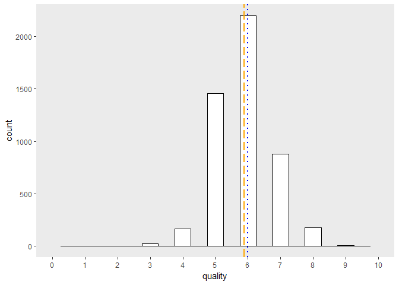<!-- -->


```
## 
##    3    4    5    6    7    8    9 
##   20  163 1457 2198  880  175    5
```

The distribution of quality is approximately normal. With a median of 6 and 
mean of 5.878, we can see the center of the data is slightly skewed toward the
higher values. I would say the data exhibits a very slight left skew.

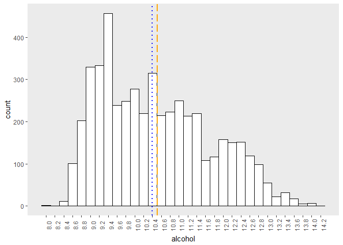<!-- -->

This is interesting because the data for alcohol is not normally distributed.
The data is right skewed with the mean and median values at 10.51 and 10.4 
respectively. However, the largest bin is 9.4 percent alcohol by volume.


```
## white$quality: 3
##    Min. 1st Qu.  Median    Mean 3rd Qu.    Max. 
##    8.00    9.55   10.45   10.35   11.00   12.60 
## -------------------------------------------------------- 
## white$quality: 4
##    Min. 1st Qu.  Median    Mean 3rd Qu.    Max. 
##    8.40    9.40   10.10   10.15   10.75   13.50 
## -------------------------------------------------------- 
## white$quality: 5
##    Min. 1st Qu.  Median    Mean 3rd Qu.    Max. 
##   8.000   9.200   9.500   9.809  10.300  13.600 
## -------------------------------------------------------- 
## white$quality: 6
##    Min. 1st Qu.  Median    Mean 3rd Qu.    Max. 
##    8.50    9.60   10.50   10.58   11.40   14.00 
## -------------------------------------------------------- 
## white$quality: 7
##    Min. 1st Qu.  Median    Mean 3rd Qu.    Max. 
##    8.60   10.60   11.40   11.37   12.30   14.20 
## -------------------------------------------------------- 
## white$quality: 8
##    Min. 1st Qu.  Median    Mean 3rd Qu.    Max. 
##    8.50   11.00   12.00   11.64   12.60   14.00 
## -------------------------------------------------------- 
## white$quality: 9
##    Min. 1st Qu.  Median    Mean 3rd Qu.    Max. 
##   10.40   12.40   12.50   12.18   12.70   12.90
```

It appears that in most, but not all cases, the alcohol content is more 
positively correlated with wine quality. The Pearson correlation coefficient is
0.4355747.

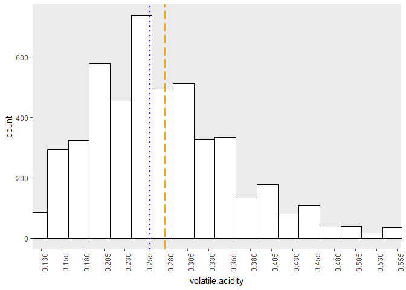<!-- -->


```
## white$quality: 3
##    Min. 1st Qu.  Median    Mean 3rd Qu.    Max. 
##  0.1700  0.2375  0.2600  0.3332  0.4125  0.6400 
## -------------------------------------------------------- 
## white$quality: 4
##    Min. 1st Qu.  Median    Mean 3rd Qu.    Max. 
##  0.1100  0.2700  0.3200  0.3812  0.4600  1.1000 
## -------------------------------------------------------- 
## white$quality: 5
##    Min. 1st Qu.  Median    Mean 3rd Qu.    Max. 
##   0.100   0.240   0.280   0.302   0.340   0.905 
## -------------------------------------------------------- 
## white$quality: 6
##    Min. 1st Qu.  Median    Mean 3rd Qu.    Max. 
##  0.0800  0.2000  0.2500  0.2606  0.3000  0.9650 
## -------------------------------------------------------- 
## white$quality: 7
##    Min. 1st Qu.  Median    Mean 3rd Qu.    Max. 
##  0.0800  0.1900  0.2500  0.2628  0.3200  0.7600 
## -------------------------------------------------------- 
## white$quality: 8
##    Min. 1st Qu.  Median    Mean 3rd Qu.    Max. 
##  0.1200  0.2000  0.2600  0.2774  0.3300  0.6600 
## -------------------------------------------------------- 
## white$quality: 9
##    Min. 1st Qu.  Median    Mean 3rd Qu.    Max. 
##   0.240   0.260   0.270   0.298   0.360   0.360
```

The volatile acidity can, in high amounts, impart vinegar-like taste. The data
for this feature is significantly right skewed.

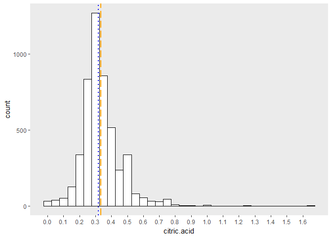<!-- -->

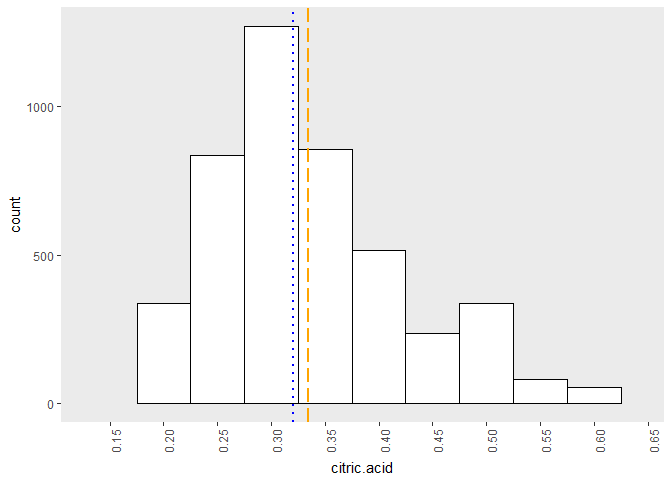<!-- -->

The data for this feature is right skewed; however, after zooming in to exclude
outliers, the distribution is relatively normal. I might be able to combine 
this feature with another, or others, and glean some significant insights from
it. Citric acid adds a freshness or light flavor to wine.


```
## white$quality: 3
##    Min. 1st Qu.  Median    Mean 3rd Qu.    Max. 
##  0.2100  0.2575  0.3450  0.3360  0.3850  0.4700 
## -------------------------------------------------------- 
## white$quality: 4
##    Min. 1st Qu.  Median    Mean 3rd Qu.    Max. 
##  0.0000  0.1900  0.2900  0.3042  0.4000  0.8800 
## -------------------------------------------------------- 
## white$quality: 5
##    Min. 1st Qu.  Median    Mean 3rd Qu.    Max. 
##  0.0000  0.2400  0.3200  0.3377  0.4100  1.0000 
## -------------------------------------------------------- 
## white$quality: 6
##    Min. 1st Qu.  Median    Mean 3rd Qu.    Max. 
##   0.000   0.270   0.320   0.338   0.380   1.660 
## -------------------------------------------------------- 
## white$quality: 7
##    Min. 1st Qu.  Median    Mean 3rd Qu.    Max. 
##  0.0100  0.2800  0.3100  0.3256  0.3600  0.7400 
## -------------------------------------------------------- 
## white$quality: 8
##    Min. 1st Qu.  Median    Mean 3rd Qu.    Max. 
##  0.0400  0.2800  0.3200  0.3265  0.3600  0.7400 
## -------------------------------------------------------- 
## white$quality: 9
##    Min. 1st Qu.  Median    Mean 3rd Qu.    Max. 
##   0.290   0.340   0.360   0.386   0.450   0.490
```

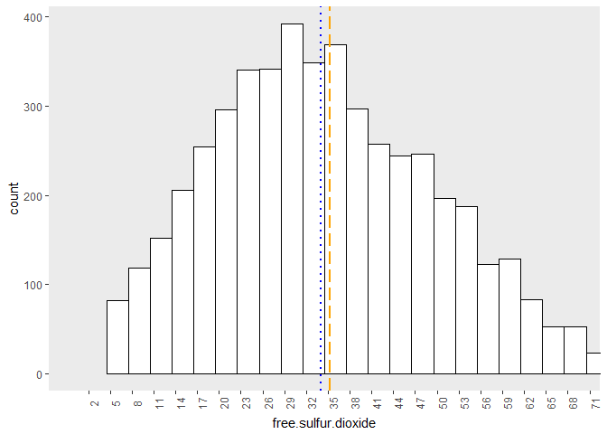<!-- -->


```
## white$quality: 3
##    Min. 1st Qu.  Median    Mean 3rd Qu.    Max. 
##    5.00   13.25   33.50   53.33   47.50  289.00 
## -------------------------------------------------------- 
## white$quality: 4
##    Min. 1st Qu.  Median    Mean 3rd Qu.    Max. 
##    3.00    9.00   18.00   23.36   30.50  138.50 
## -------------------------------------------------------- 
## white$quality: 5
##    Min. 1st Qu.  Median    Mean 3rd Qu.    Max. 
##    2.00   22.00   35.00   36.43   50.00  131.00 
## -------------------------------------------------------- 
## white$quality: 6
##    Min. 1st Qu.  Median    Mean 3rd Qu.    Max. 
##    3.00   24.00   34.00   35.65   46.00  112.00 
## -------------------------------------------------------- 
## white$quality: 7
##    Min. 1st Qu.  Median    Mean 3rd Qu.    Max. 
##    5.00   25.00   33.00   34.13   41.00  108.00 
## -------------------------------------------------------- 
## white$quality: 8
##    Min. 1st Qu.  Median    Mean 3rd Qu.    Max. 
##    6.00   28.00   35.00   36.72   44.50  105.00 
## -------------------------------------------------------- 
## white$quality: 9
##    Min. 1st Qu.  Median    Mean 3rd Qu.    Max. 
##    24.0    27.0    28.0    33.4    31.0    57.0
```

After zooming in to exclude outliers, the distribution of free sulfur dioxide
is normal. This is a feature I may be able to work with during later analysis.

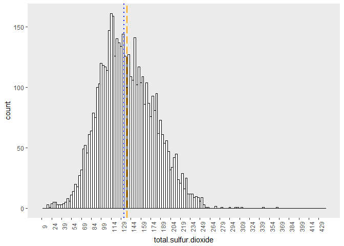<!-- -->

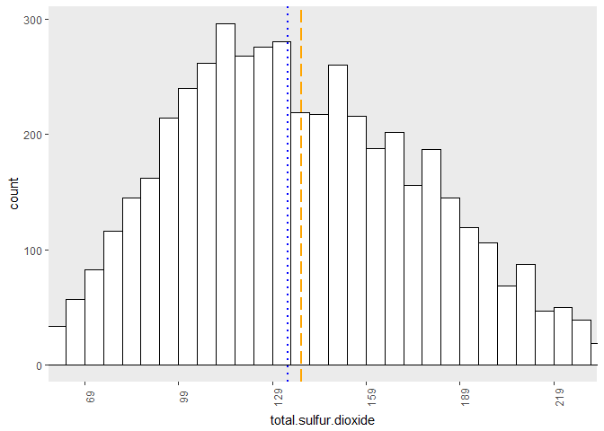<!-- -->

I like the look of this second histogram for total.sulfur.dioxide much better.
After zooming to remove outliers, we can see the distribution presents a mostly
normal appearance with some skew still extending to the right.

Let's create two new features as the percentage of free sulfur dioxide and
bound sulfur dioxide.


```r
white$so2.free.percent <- white$free.sulfur.dioxide / white$total.sulfur.dioxide
white$so2.bound.percent <- 1 - white$so2.free.percent
```

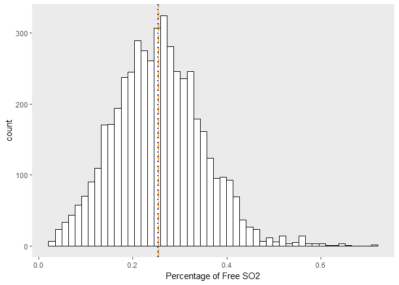<!-- -->


```
## white$quality: 3
##    Min. 1st Qu.  Median    Mean 3rd Qu.    Max. 
## 0.04587 0.13952 0.19859 0.25736 0.29928 0.65682 
## -------------------------------------------------------- 
## white$quality: 4
##    Min. 1st Qu.  Median    Mean 3rd Qu.    Max. 
## 0.03371 0.10462 0.15730 0.18042 0.23539 0.58140 
## -------------------------------------------------------- 
## white$quality: 5
##    Min. 1st Qu.  Median    Mean 3rd Qu.    Max. 
## 0.02362 0.17188 0.23810 0.23772 0.29646 0.65000 
## -------------------------------------------------------- 
## white$quality: 6
##    Min. 1st Qu.  Median    Mean 3rd Qu.    Max. 
## 0.03361 0.19836 0.25862 0.26217 0.32046 0.71053 
## -------------------------------------------------------- 
## white$quality: 7
##    Min. 1st Qu.  Median    Mean 3rd Qu.    Max. 
##  0.0500  0.2118  0.2717  0.2757  0.3333  0.6429 
## -------------------------------------------------------- 
## white$quality: 8
##    Min. 1st Qu.  Median    Mean 3rd Qu.    Max. 
## 0.07895 0.22308 0.28829 0.28923 0.33635 0.60377 
## -------------------------------------------------------- 
## white$quality: 9
##    Min. 1st Qu.  Median    Mean 3rd Qu.    Max. 
##  0.1942  0.2258  0.2743  0.2911  0.2824  0.4790
```

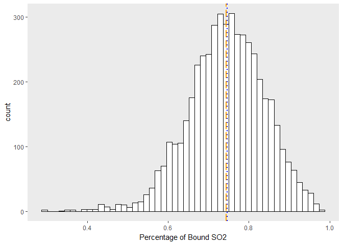<!-- -->


```
## white$quality: 3
##    Min. 1st Qu.  Median    Mean 3rd Qu.    Max. 
##  0.3432  0.7007  0.8014  0.7426  0.8605  0.9541 
## -------------------------------------------------------- 
## white$quality: 4
##    Min. 1st Qu.  Median    Mean 3rd Qu.    Max. 
##  0.4186  0.7646  0.8427  0.8196  0.8954  0.9663 
## -------------------------------------------------------- 
## white$quality: 5
##    Min. 1st Qu.  Median    Mean 3rd Qu.    Max. 
##  0.3500  0.7035  0.7619  0.7623  0.8281  0.9764 
## -------------------------------------------------------- 
## white$quality: 6
##    Min. 1st Qu.  Median    Mean 3rd Qu.    Max. 
##  0.2895  0.6795  0.7414  0.7378  0.8016  0.9664 
## -------------------------------------------------------- 
## white$quality: 7
##    Min. 1st Qu.  Median    Mean 3rd Qu.    Max. 
##  0.3571  0.6667  0.7283  0.7243  0.7882  0.9500 
## -------------------------------------------------------- 
## white$quality: 8
##    Min. 1st Qu.  Median    Mean 3rd Qu.    Max. 
##  0.3962  0.6637  0.7117  0.7108  0.7769  0.9211 
## -------------------------------------------------------- 
## white$quality: 9
##    Min. 1st Qu.  Median    Mean 3rd Qu.    Max. 
##  0.5210  0.7176  0.7257  0.7089  0.7742  0.8058
```

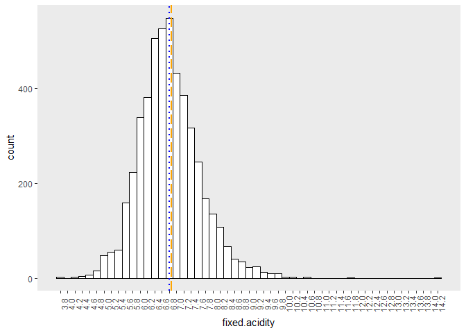<!-- -->

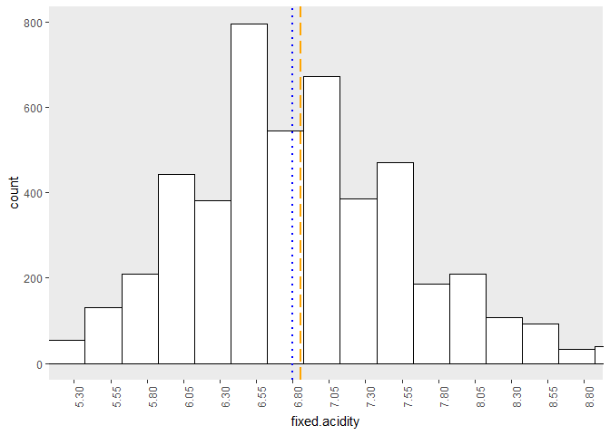<!-- -->


```
## white$quality: 3
##    Min. 1st Qu.  Median    Mean 3rd Qu.    Max. 
##   4.200   6.575   7.300   7.600   8.525  11.800 
## -------------------------------------------------------- 
## white$quality: 4
##    Min. 1st Qu.  Median    Mean 3rd Qu.    Max. 
##   4.800   6.400   6.900   7.129   7.600  10.200 
## -------------------------------------------------------- 
## white$quality: 5
##    Min. 1st Qu.  Median    Mean 3rd Qu.    Max. 
##   4.500   6.400   6.800   6.934   7.400  10.300 
## -------------------------------------------------------- 
## white$quality: 6
##    Min. 1st Qu.  Median    Mean 3rd Qu.    Max. 
##   3.800   6.300   6.800   6.838   7.300  14.200 
## -------------------------------------------------------- 
## white$quality: 7
##    Min. 1st Qu.  Median    Mean 3rd Qu.    Max. 
##   4.200   6.200   6.700   6.735   7.200   9.200 
## -------------------------------------------------------- 
## white$quality: 8
##    Min. 1st Qu.  Median    Mean 3rd Qu.    Max. 
##   3.900   6.200   6.800   6.657   7.300   8.200 
## -------------------------------------------------------- 
## white$quality: 9
##    Min. 1st Qu.  Median    Mean 3rd Qu.    Max. 
##    6.60    6.90    7.10    7.42    7.40    9.10
```

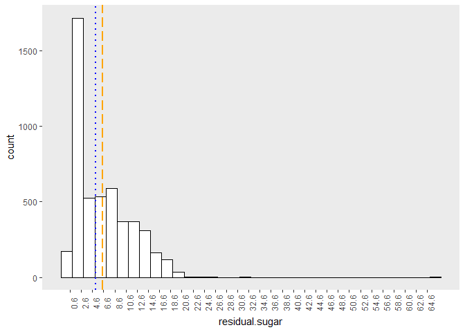<!-- -->

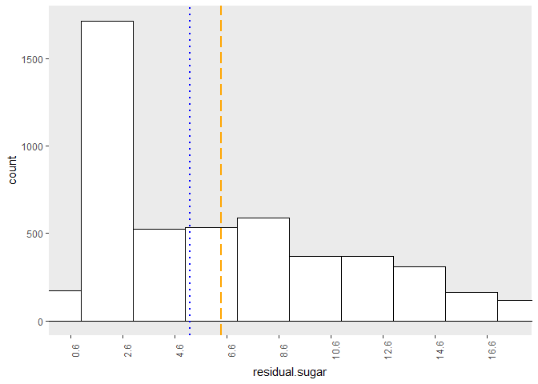<!-- -->


```
## white$quality: 3
##    Min. 1st Qu.  Median    Mean 3rd Qu.    Max. 
##   0.700   1.587   4.600   6.393  10.700  16.200 
## -------------------------------------------------------- 
## white$quality: 4
##    Min. 1st Qu.  Median    Mean 3rd Qu.    Max. 
##   0.700   1.300   2.500   4.628   7.100  17.550 
## -------------------------------------------------------- 
## white$quality: 5
##    Min. 1st Qu.  Median    Mean 3rd Qu.    Max. 
##   0.600   1.800   7.000   7.335  11.500  23.500 
## -------------------------------------------------------- 
## white$quality: 6
##    Min. 1st Qu.  Median    Mean 3rd Qu.    Max. 
##   0.700   1.700   5.300   6.442   9.900  65.800 
## -------------------------------------------------------- 
## white$quality: 7
##    Min. 1st Qu.  Median    Mean 3rd Qu.    Max. 
##   0.900   1.700   3.650   5.186   7.325  19.250 
## -------------------------------------------------------- 
## white$quality: 8
##    Min. 1st Qu.  Median    Mean 3rd Qu.    Max. 
##   0.800   2.100   4.300   5.671   8.200  14.800 
## -------------------------------------------------------- 
## white$quality: 9
##    Min. 1st Qu.  Median    Mean 3rd Qu.    Max. 
##    1.60    2.00    2.20    4.12    4.20   10.60
```

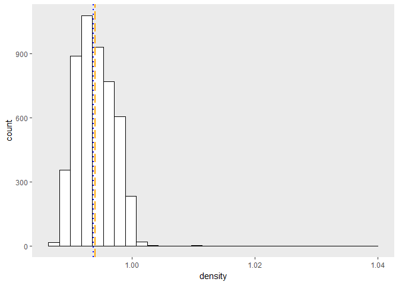<!-- -->

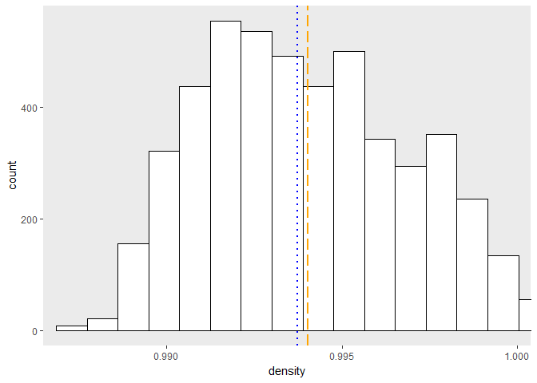<!-- -->

Excluding the outliers, the remaining distribution is relatively normal. Let's
view the data by quality to see what else we can draw out.


```
## white$quality: 3
##    Min. 1st Qu.  Median    Mean 3rd Qu.    Max. 
##  0.9911  0.9925  0.9944  0.9949  0.9969  1.0001 
## -------------------------------------------------------- 
## white$quality: 4
##    Min. 1st Qu.  Median    Mean 3rd Qu.    Max. 
##  0.9892  0.9926  0.9941  0.9943  0.9958  1.0004 
## -------------------------------------------------------- 
## white$quality: 5
##    Min. 1st Qu.  Median    Mean 3rd Qu.    Max. 
##  0.9872  0.9933  0.9953  0.9953  0.9972  1.0024 
## -------------------------------------------------------- 
## white$quality: 6
##    Min. 1st Qu.  Median    Mean 3rd Qu.    Max. 
##  0.9876  0.9917  0.9937  0.9940  0.9959  1.0390 
## -------------------------------------------------------- 
## white$quality: 7
##    Min. 1st Qu.  Median    Mean 3rd Qu.    Max. 
##  0.9871  0.9906  0.9918  0.9925  0.9937  1.0004 
## -------------------------------------------------------- 
## white$quality: 8
##    Min. 1st Qu.  Median    Mean 3rd Qu.    Max. 
##  0.9871  0.9903  0.9916  0.9922  0.9935  1.0006 
## -------------------------------------------------------- 
## white$quality: 9
##    Min. 1st Qu.  Median    Mean 3rd Qu.    Max. 
##  0.9897  0.9898  0.9903  0.9915  0.9906  0.9970
```

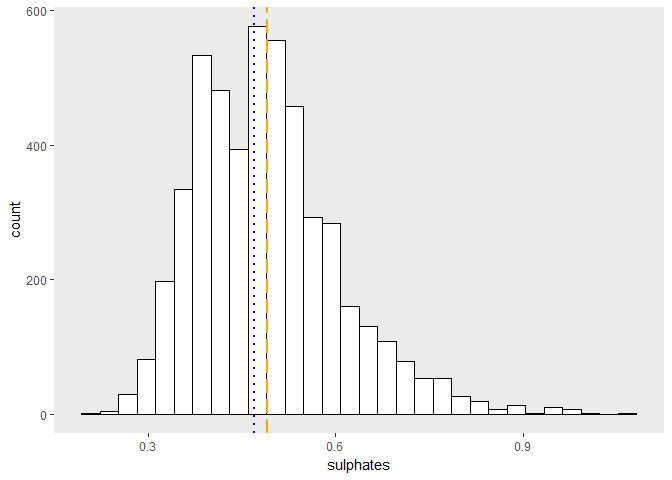<!-- -->


```
## white$quality: 3
##    Min. 1st Qu.  Median    Mean 3rd Qu.    Max. 
##  0.2800  0.3800  0.4400  0.4745  0.5425  0.7400 
## -------------------------------------------------------- 
## white$quality: 4
##    Min. 1st Qu.  Median    Mean 3rd Qu.    Max. 
##  0.2500  0.3800  0.4700  0.4761  0.5400  0.8700 
## -------------------------------------------------------- 
## white$quality: 5
##    Min. 1st Qu.  Median    Mean 3rd Qu.    Max. 
##  0.2700  0.4200  0.4700  0.4822  0.5300  0.8800 
## -------------------------------------------------------- 
## white$quality: 6
##    Min. 1st Qu.  Median    Mean 3rd Qu.    Max. 
##  0.2300  0.4100  0.4800  0.4911  0.5500  1.0600 
## -------------------------------------------------------- 
## white$quality: 7
##    Min. 1st Qu.  Median    Mean 3rd Qu.    Max. 
##  0.2200  0.4100  0.4800  0.5031  0.5800  1.0800 
## -------------------------------------------------------- 
## white$quality: 8
##    Min. 1st Qu.  Median    Mean 3rd Qu.    Max. 
##  0.2500  0.3800  0.4600  0.4862  0.5850  0.9500 
## -------------------------------------------------------- 
## white$quality: 9
##    Min. 1st Qu.  Median    Mean 3rd Qu.    Max. 
##   0.360   0.420   0.460   0.466   0.480   0.610
```

# Univariate Analysis

#### What is the structure of your dataset?

The data is now structured with 13 continuous features and 1 discrete, categorical
output feature. With nearly 5000 observations, I may be able to glean more 
detailed insights or create more granular plots as compared to the red wines
dataset of 1600 observations.

#### What is/are the main feature(s) of interest in your dataset?

The primary feature I am interested in is the output variable, quality. If
the wine does not taste good, no one will drink it or even give much thought
to its characteristics influencing that quality.

#### What other features in the dataset do you think will help support your \
investigation into your feature(s) of interest?

The other features I am interested in pertain to specific influences of taste.
These are residual sugar and various measures of acidity.

#### Did you create any new variables from existing variables in the dataset?

I created a single new variable as free sulfur dioxide divided by the total 
sulfur dioxide. This proporation is normally distributed and may allow a better
spread of the data while trying to extract meaningful insights.

#### Of the features you investigated, were there any unusual distributions? \
Did you perform any operations on the data to tidy, adjust, or change the form \
of the data? If so, why did you do this?

While I did not have to clean the data or make it tidy, I did observe unusual
distributions of a handful of features. The unusual distribution could lead to
some interesting insights, or perhaps lead me to a dead end.

# Bivariate Plots Section


```
##                      fixed.acidity volatile.acidity citric.acid
## fixed.acidity                1.000           -0.023       0.289
## volatile.acidity            -0.023            1.000      -0.149
## citric.acid                  0.289           -0.149       1.000
## residual.sugar               0.089            0.064       0.094
## chlorides                    0.023            0.071       0.114
## free.sulfur.dioxide         -0.049           -0.097       0.094
## total.sulfur.dioxide         0.091            0.089       0.121
## density                      0.265            0.027       0.150
## pH                          -0.426           -0.032      -0.164
## sulphates                   -0.017           -0.036       0.062
## alcohol                     -0.121            0.068      -0.076
## quality                     -0.114           -0.195      -0.009
## so2.free.percent            -0.139           -0.196       0.016
## so2.bound.percent            0.139            0.196      -0.016
##                      residual.sugar chlorides free.sulfur.dioxide
## fixed.acidity                 0.089     0.023              -0.049
## volatile.acidity              0.064     0.071              -0.097
## citric.acid                   0.094     0.114               0.094
## residual.sugar                1.000     0.089               0.299
## chlorides                     0.089     1.000               0.101
## free.sulfur.dioxide           0.299     0.101               1.000
## total.sulfur.dioxide          0.401     0.199               0.616
## density                       0.839     0.257               0.294
## pH                           -0.194    -0.090              -0.001
## sulphates                    -0.027     0.017               0.059
## alcohol                      -0.451    -0.360              -0.250
## quality                      -0.098    -0.210               0.008
## so2.free.percent              0.051    -0.033               0.739
## so2.bound.percent            -0.051     0.033              -0.739
##                      total.sulfur.dioxide density     pH sulphates alcohol
## fixed.acidity                       0.091   0.265 -0.426    -0.017  -0.121
## volatile.acidity                    0.089   0.027 -0.032    -0.036   0.068
## citric.acid                         0.121   0.150 -0.164     0.062  -0.076
## residual.sugar                      0.401   0.839 -0.194    -0.027  -0.451
## chlorides                           0.199   0.257 -0.090     0.017  -0.360
## free.sulfur.dioxide                 0.616   0.294 -0.001     0.059  -0.250
## total.sulfur.dioxide                1.000   0.530  0.002     0.135  -0.449
## density                             0.530   1.000 -0.094     0.074  -0.780
## pH                                  0.002  -0.094  1.000     0.156   0.121
## sulphates                           0.135   0.074  0.156     1.000  -0.017
## alcohol                            -0.449  -0.780  0.121    -0.017   1.000
## quality                            -0.175  -0.307  0.099     0.054   0.436
## so2.free.percent                   -0.013  -0.066  0.001    -0.022   0.064
## so2.bound.percent                   0.013   0.066 -0.001     0.022  -0.064
##                      quality so2.free.percent so2.bound.percent
## fixed.acidity         -0.114           -0.139             0.139
## volatile.acidity      -0.195           -0.196             0.196
## citric.acid           -0.009            0.016            -0.016
## residual.sugar        -0.098            0.051            -0.051
## chlorides             -0.210           -0.033             0.033
## free.sulfur.dioxide    0.008            0.739            -0.739
## total.sulfur.dioxide  -0.175           -0.013             0.013
## density               -0.307           -0.066             0.066
## pH                     0.099            0.001            -0.001
## sulphates              0.054           -0.022             0.022
## alcohol                0.436            0.064            -0.064
## quality                1.000            0.197            -0.197
## so2.free.percent       0.197            1.000            -1.000
## so2.bound.percent     -0.197           -1.000             1.000
```

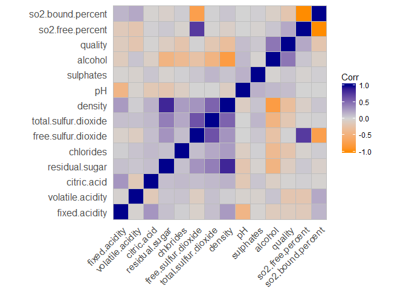<!-- -->

This correlation plot is not encouraging in determining very many strong 
relationships, at least at a rudimentary level. I will likely need to slice and 
manipulate my plots further to glean actionable insights. The multivariate 
plots should help drill down better in the section following.

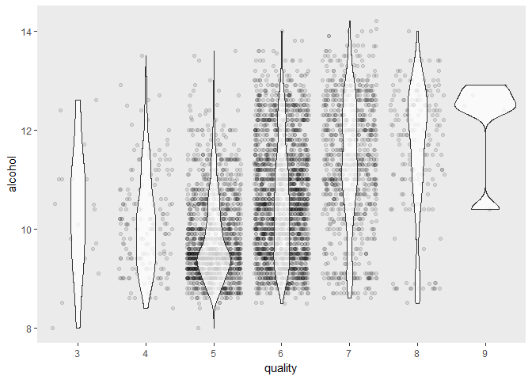<!-- -->

Although faint, there may a positive correlation between quality and alcohol
content. The correlation coefficient of these two features is 
0.4355747. One satisfying aspect of this particular
visualization is the shape of the violin for the highest quality wines: it
distinctly resembles a wine glass.

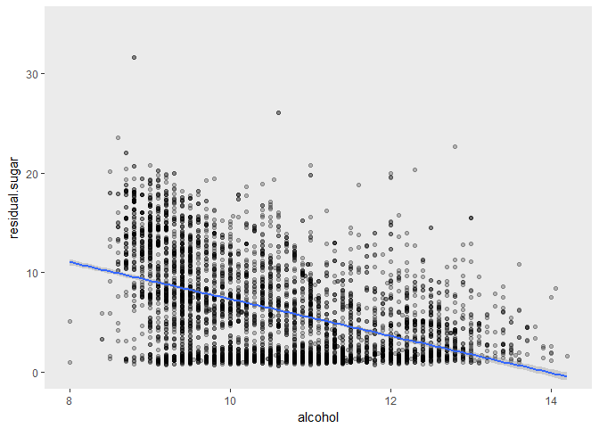<!-- -->

This plot suggests a weak to moderate negative correlation between alcohol and
residual sugar. Higher residual sugar levels more frequently correspond to 
lower alcohol levels. This surprises me to certain degree because other types 
of strong alcohols try to make their beverage more palatable and to mask the 
strength of the alcohol. This, however, suggests many of the strong wines have
lower levels of residual sugar.

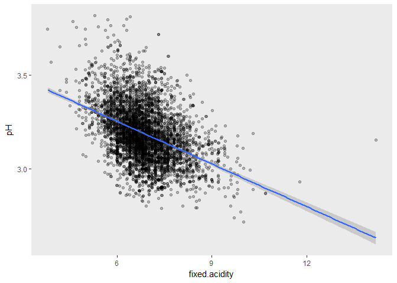<!-- -->

pH and fixed.acidity shows a moderate negative correlation as I expected. This
is due to acids being represented by lower values on the pH scale.

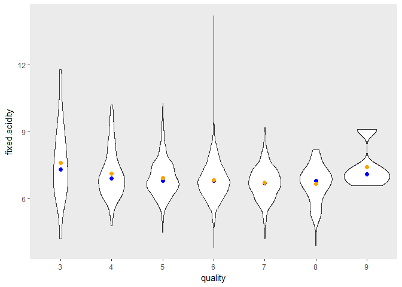<!-- -->

I was hopeful the fixed acidity level might be well described by quality; 
however, the correlation appears to be weakly negative to not correlated.


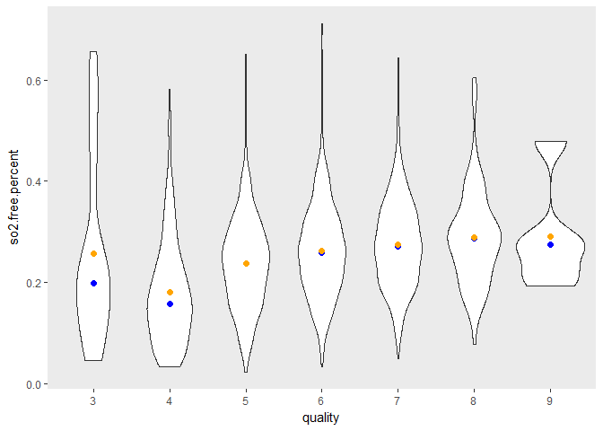<!-- -->

The percentage of free sulfur dioxide compared to the total, did not end up as
descriptive as I anticipated it could be, nor predictive in terms of one being
described by the other.

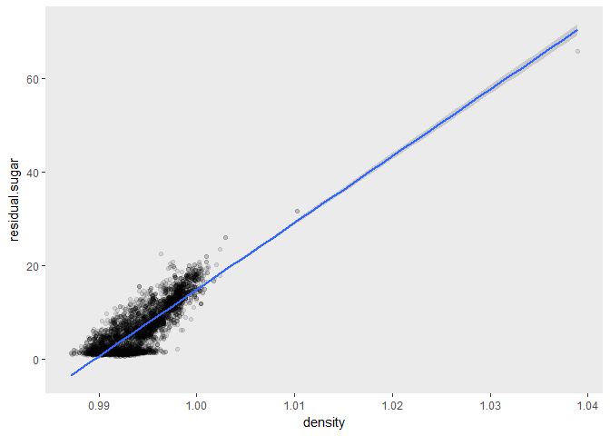<!-- -->

Even without zooming in to confirm at a smaller scale, I can see a strongly
positive correlation between density and residual sugars. This is expected
because sugar is typically heavier and more dense than the other chemicals
composing a beverage or other liquid solution.

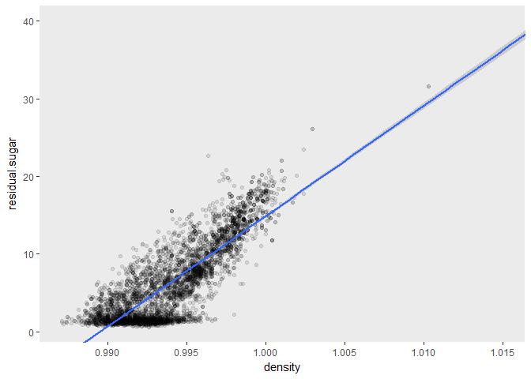<!-- -->

Zoomed in, the previous plot trendline is more easily observed. There is a 
strong correlation between density and residual.sugar; it's one I will want to
further explore in the multivariate section.

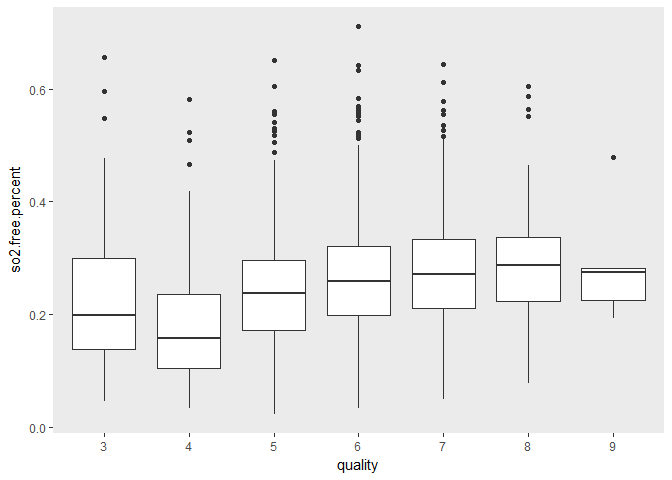<!-- -->

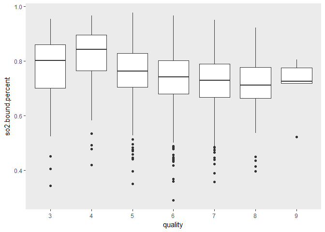<!-- -->

I think these percentage features can allow me greater insights into the quality
of white wines. SO2 is required to prevent oxidation, however, a balance must 
be found to prevent a strong sulfuric smell in the nose or the taste.

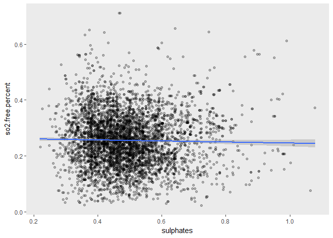<!-- -->

I was genuinely surprised there is effectively no correlation between sulphates
and so2.percent. I would expect one feature to influence the other, yet this
plot suggests that is not the case.

# Bivariate Analysis

### Talk about some of the relationships you observed in this part of the \
investigation. How did the feature(s) of interest vary with other features in \
the dataset?

I think there may be relationships between multiple variables rather than
simply two variables. Most of the visualizations I developed did not 
demonstrate a strong or even moderate correlation. Only a handful of plots 
alone showed a relationship between the two variables.

### Did you observe any interesting relationships between the other features \
(not the main feature(s) of interest)?

I think the most interesting relationship I uncovered was the moderate,
negative correlation between alcohol and residual sugars. Other types of strong
alcohols add sugar and mask the strength of the alcohol. This, however, 
suggests many of the strong wines have lower levels of residual sugar.
There may be some process of wine creation that could explain this correlation.

### What was the strongest relationship you found?

The strongest relationship was one I expected: residual sugar vs. density. The
density of wine was strongly correlated with residual sugars and that is 
expected because any residual sugar would add density to a liquid solution.


# Multivariate Plots Section

Let's create two new categorical variable for better plotting across multiple
variables. These will be defined by the following:


```r
white$alcohol_quartiles = cut(white$alcohol,
                              breaks = 4)
```


```r
white$quality_categories <- cut(white$quality,
                                breaks = 3)
```

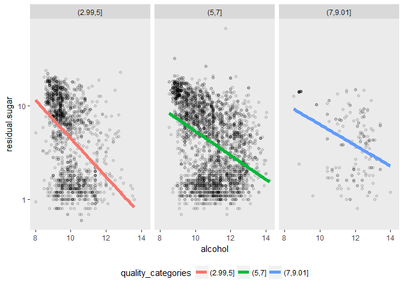<!-- -->

There appears to be almost of sweet spot (no pun intended) for acceptable 
ranges of residual sugar and they are negatively correlated with alcohol 
content. Across all three categories of wine quality this holds true.

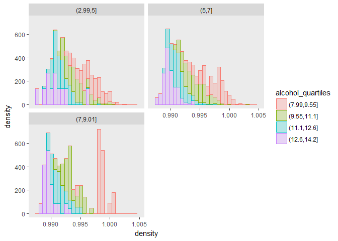<!-- -->

In the previous section, we witnessed a strong correlation (0.839) between 
density and residual.sugar. Given their correlation and the negative 
correlation of residual.sugar with alcohol, density could be used in 
conjunction both of those features to better cluster wines of similar quality.

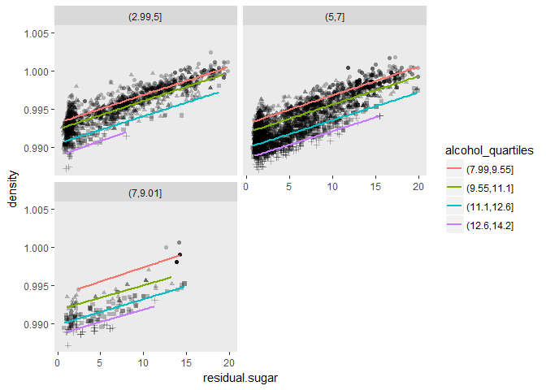<!-- -->

There are multiple encodings in this faceted plot, but it is very informative
in terms of clustering qualities of wine. Characterized as density described by
residual.sugar, faceted by quality categories, colored and shaped by alcohol 
quartiles. I notice the higher occurrance of low alcohol levels in the lower
rated wines. At the same time, I notice high alcohol levels in the highest
rated wines. This suggests higher alcohol content is correlated with higher
quality ratings of wine.

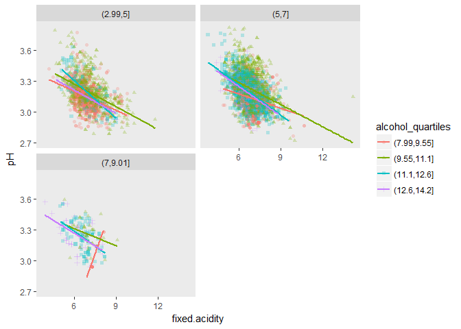<!-- -->

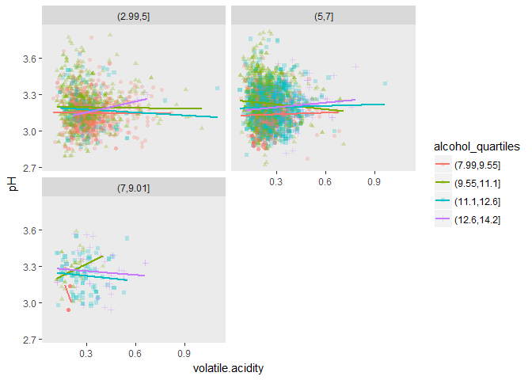<!-- -->

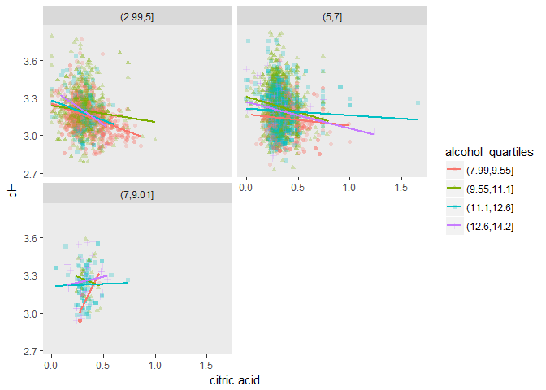<!-- -->

Plotting pH across the three different types of yielded interesting results
because it appears citric.acid and volatile.acidity have far less influence on
pH than fixed.acidity. The negative slopes of each figure suggests 
fixed.acidity has greater influence on pH than the other two.

# Multivariate Analysis

### Talk about some of the relationships you observed in this part of the \
investigation. Were there features that strengthened each other in terms of \
looking at your feature(s) of interest?

I was surprised by the number of features having little to no correlation on
my feature of interest, quality. Having said that, there were a handful of 
features most descriptive in terms of identifying trends in the dataset.

### Were there any interesting or surprising interactions between features?

I was surprised to see less correlation of the acid items and pH than the data
demonstrated. One would expect acids to directly affect the measurement of 
acidity.

I was also surprised to see weak interactions between many of the features 
of this dataset. The correlation matrix demonstrated there were very few 
correlations between a number of the features. I was able to adapt a number
of the features and build effective plots; however, the relationships were 
less apparent than I anticipated.

------

# Final Plots and Summary

### Plot One
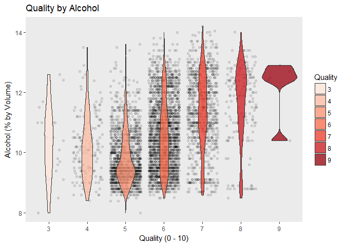<!-- -->

### Description One

The violinplot atop the scatterplot identifies a trend of higher alcohol
content correlating with high quality ratings. This correlation serves as a
starting point for other plots during the exploratory phase and helps consider
other methods of slicing and viewing data in order to glean deeper trends and
insights.

### Plot Two

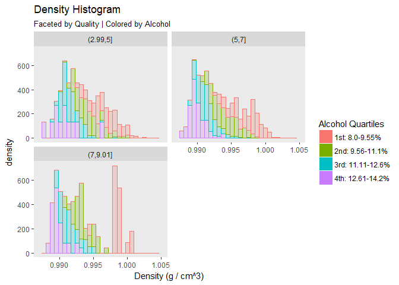<!-- -->

### Description Two

Density provided some insight into alcohol levels by way of the sugars present
during the fermentation process were converted to alcohol. The concentration of
alcohol and reduction of sugars resulted in lower density levels. This allows
for cleaner groupings of qualities and alcohol quartiles.

### Plot Three
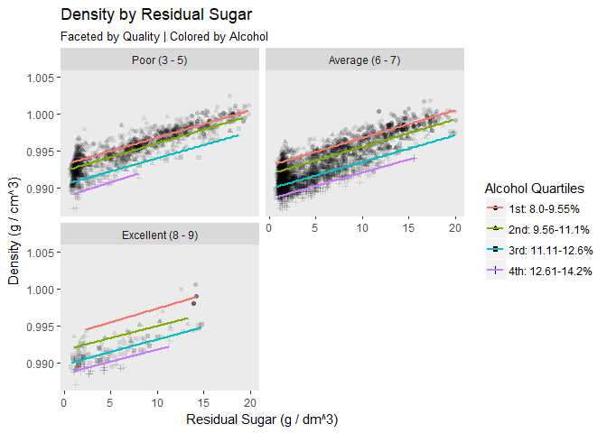<!-- -->

### Description Three

Combining the most useful insights together into one plot, viewing density by 
residual.sugar, faceted by quality categories, and colored by alcohol quartiles
affords a clearer picture of separation between the features comprising 
different qualities of white wine. Provided data points for alcohol, density,
and residual.sugar, one could reasonably build a linear regression model to 
predict quality ratings using a formula similar to the following:


```r
lm(quality ~ alcohol + residual.sugar + density, data = white)
```

```
## 
## Call:
## lm(formula = quality ~ alcohol + residual.sugar + density, data = white)
## 
## Coefficients:
##    (Intercept)         alcohol  residual.sugar         density  
##       90.31292         0.24587         0.05332       -87.88589
```

------
  
# Reflection

The most significant reflection is I need more practice using R for data 
visualization. While producing quick and dirty plots for EDA was not the
source of some difficulty, creating publisher-ready plots with titles,
legends, labelled axes, etc., bogged me down and extended the time I 
expected this project to take.

Another point is I wish there were higher levels of correlation between
features. There were not very clearly delineated relationships. I suppose
that is more common that one would expect, but it was a little frustrating
at times trying to demonstrate relationships that would be described as 
moderate at best.

On a personl level, I'm interested to know which wine types corresponded to
which flavor profiles. I have my personal preferences for taste and I'm very
curious to see where those wines line up in terms of their quality. It has
no analytical significance for the project; it simply piqued my curiosity in
exploring my tastes in wine.
